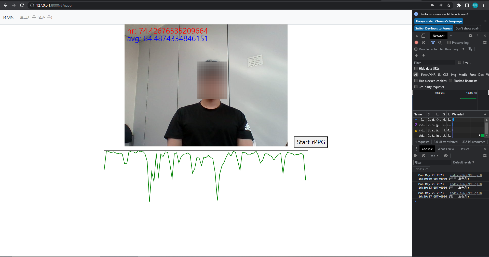
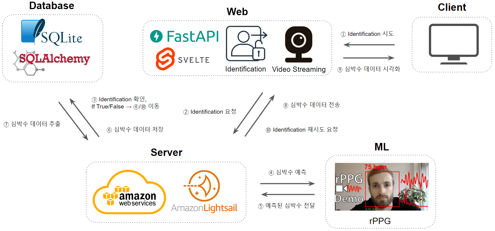

# Web Based Health Monitoring Using rPPG
2023년 1학기 캡스톤 설계 프로젝트

Web Based Health Monitoring Using rPPG: rPPG 기술을 활용한 웹 기반 건강 모니터링 서비스


## __Demo__

<p align="center"></p>

## __Architecture__
<p align="center"></p>

## __Usage__

### Requirements
  * Python 3.10+
  * Window or Ubuntu

### Libaray
- OpenCV 4.7.0
- tensorflow(2.12.0)
- uvicorn(0.22.0)
- SQLAlchemy(2.0.15)
- python-jose(3.3.0)
- scikit-image(0.20.0)
- python-multipart(0.0.6)

### Installation
```python
pip install fastapi
pip install "uvicorn[standard]"
pip install sqlalchemy
pip install alembic
pip install "pydantic[email]"
pip install "passlib[bcrypt]"
pip install python-multipart
pip install "python-jose[cryptography]"
pip install scikit-image
pip install opencv-python
pip install tensorflow
```
### Database Initialization
```sh
ubuntu@rppg:~/projects$ cd rppg
ubuntu@rppg:~/projects/rppg$ alembic init migrations
``` 
alembic.ini 파일을 편집기로 열어 다음과 같이 수정  
[/home/ubuntu/projects/rppg/alembic.ini]
```sh
(... 생략 ...)
sqlalchemy.url = sqlite:///./rppg.db
(... 생략 ...)
```
migrations 디렉터리의 env.py도 다음과 같이 수정  
[/home/ubuntu/projects/rppg/migrations/env.py]
```sh
(... 생략 ...)

# add your model's MetaData object here
# for 'autogenerate' support
# from myapp import mymodel
# target_metadata = mymodel.Base.metadata
import models
target_metadata = models.Base.metadata

(... 생략 ...)
```
아래 코드 실행 후 rppg.db 파일 생성 확인
``` sh
ubuntu@rppg:~/projects/rppg$ alembic revision --autogenerate
ubuntu@rppg:~/projects/rppg$ alembic upgrade head
```

### Excution
```python
uvicorn main:app --reload --host=0.0.0.0
```
